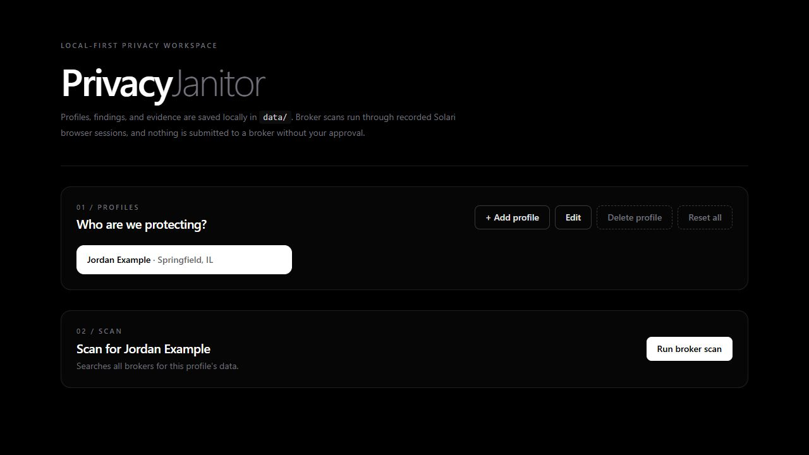
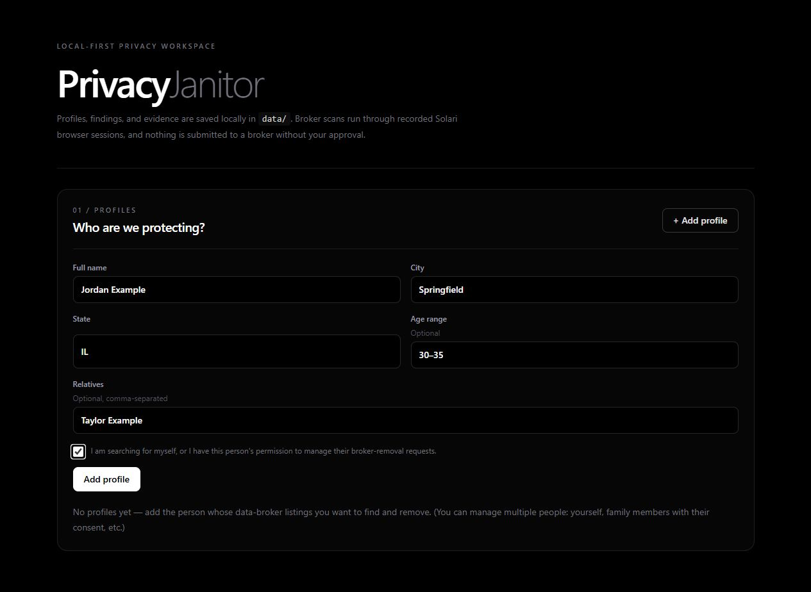
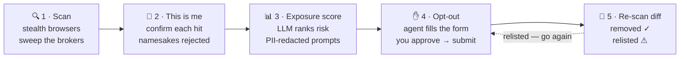

<div align="center">

# 🧹 PrivacyJanitor

### Find your personal data on people-search sites — and make it disappear.

**Local-first, open-source data-broker removal agent.** It finds your PII on people-search
sites and automates the *official* opt-out flows — driven by [Solari](https://getsolari.com)
cloud stealth browsers, with screenshot and session-replay evidence for every single action.


</div>

---

Data brokers publish your home address, phone number, age, and relatives — and by law they
have to take it down when you ask. Incogni ($30/mo) and DeleteMe ($129/yr) charge you to send
those requests. PrivacyJanitor sends them for you, from your own machine, for free.

> [!IMPORTANT]
> **Nothing is ever sent to a broker without your explicit click.** You get a screenshot of the
> filled form *before* it is submitted, and a session replay link *after*.

## See it running

The walkthrough and screenshots below use the fictional profile **Jordan Example**. No real
user data, live broker results, or live submissions are included in these repository assets.

[](docs/demo/privacy-janitor-demo.webm)

<p align="center"><a href="docs/demo/privacy-janitor-demo.webm"><strong>▶ Watch the 33-second feature walkthrough</strong></a><br><sub>Profiles, scans, match review, risk ranking, approval gates, email confirmation, removal verification, and history.</sub></p>



<p align="center"><sub><strong>Clear profile setup</strong> with explicit consent before any person is added.</sub></p>

## How it works



Every broker interaction runs inside a **recorded Solari session**, and every action files
evidence into `data/evidence/` alongside a replay URL.

## What you get

- 🔍 **Scans that actually load** — brokers 403 plain HTTP clients and throw Cloudflare walls
  at real ones. Every search runs in a stealth Chromium session with a sticky US residential
  proxy.
- 🙋 **Namesake filtering** — fact-based URL filters plus fuzzy name-slug matching narrow the
  hits; you confirm each one before it enters the queue.
- 📊 **Privacy-conscious risk ranking** — each listing gets a 0–100 exposure score and a
  plain-language rationale. Direct identifiers and profile location are tokenized before
  optional Groq scoring.
- ✋ **A hard approval gate** — forms are filled, screenshotted, and parked. Nothing submits
  until you click approve.
- 🧾 **Evidence for every action** — full-page screenshots on disk plus a Solari session replay
  for the scan, the submit, and the email confirmation.
- 🔁 **Proof of removal** — re-scans diff against the last run and split results into removed,
  still-listed, and relisted.
- 🗄️ **No account, no backend** — `node:sqlite` (zero native deps) on localhost. No sign-up, no
  telemetry, no server holding your address.

## Quickstart

```bash
git clone https://github.com/EzraStone/privacy-janitor.git
cd privacy-janitor
npm install
cp .env.example .env        # add SOLARI_API_KEY (required) + GROQ_API_KEY (optional scoring)
npm run dev                 # open http://localhost:3000
```

| Key | Needed for | Get it |
|-----|-----------|--------|
| `SOLARI_API_KEY` | **Required** — every scan and opt-out | [console.getsolari.com](https://console.getsolari.com) |
| `GROQ_API_KEY` | Optional — exposure ranking only | [console.groq.com](https://console.groq.com) |

Then work the dashboard top to bottom: **who are we scrubbing → is this you → exposure score →
opt-out queue → verify removals.**

## Broker coverage (v0.1)

| Broker | Scan | Opt-out | Email confirm | Verified |
|--------|:----:|---------|:-------------:|----------|
| Whitepages | ✅ | URL-first suppression wizard | ✅ | live 2026-08 |
| Spokeo | ✅ | optout form (url + email) | ✅ | live 2026-08 |
| FastPeopleSearch | ✅ | subject request form | ✅ | live 2026-08 |

All three block a default browser with Cloudflare/bot walls — every flow in this table was
verified end-to-end through Solari **stealth** sessions (residential proxy + auto captcha
solving + session recording).

Broker DOMs drift. Adapters live in `src/adapters/` with layered selector fallbacks, and
`npm run smoke` catches breakage early.

## Why Solari (the honest engineering reason)

Data-broker opt-out flows are *designed* to be hostile to automation:

- Whitepages hard-blocks non-browser HTTP clients (403 to any plain `fetch`)
- Opt-out forms sit behind CAPTCHA walls (reCaptcha / hCaptcha / Turnstile)
- Brokers fingerprint and IP-block datacenter traffic

PrivacyJanitor runs every flow through Solari's stealth Chromium with residential proxies and
automatic captcha solving — the tool literally cannot work without it. Each session is
recorded, so every removal has replayable evidence.

## Privacy model (read this part)

| What | Where it lives |
|------|----------------|
| Your identity, listings, submissions | `data/privacy-janitor.db` (local SQLite) |
| Evidence screenshots | `data/evidence/` (local files) |
| Data sent for optional LLM scoring | Identifiers and location values are tokenized (`[NAME_1]`, `[ADDR_1]`, `[LOCATION_1]`). See `src/scoring/redact.ts` |
| Accounts, telemetry, backend | **None.** It's a localhost web app |

The model receives the tokenized *structure* of your exposure — *"[NAME_1] appears on Broker B
with [ADDR_1], [PHONE_1] and two relatives"* — plus tokenized location context. Tokens are
mapped back locally at render time.

## Development

```bash
npm run typecheck       # strict TS, zero errors
npm run smoke           # adapter sanity checks (no API keys needed)
npm run smoke:store     # store transactions + cleanup jail (throwaway temp DB)
npm run smoke:security  # localhost boundary, origin, input, and URL checks
npm run check           # run every check plus a production build
npm run dev             # dashboard
```

### Architecture

```
src/
├── types.ts               # domain model + BrokerAdapter interface
├── store/                 # node:sqlite (zero native deps), local only
├── engine/
│   ├── solari.ts          # stealth session recipe, evidence, replay polling
│   ├── orchestrator.ts    # scan / prepare / approve / submit / confirm / rescan
│   └── cleanup.ts         # evidence deletion, path-jailed to data/evidence
├── adapters/              # one per broker + shared DOM fallback helpers
├── scoring/               # PII redaction + Groq exposure ranking
└── app/                   # Next.js dashboard + local API routes
```

### Adding a broker

Implement the `BrokerAdapter` interface (`scan`, opt-out prepare/submit, email confirm) in
`src/adapters/`, register it in `registry.ts`, and the engine handles sessions, evidence, and
storage for you. **PRs welcome** — especially new brokers and selector fixes when a DOM drifts.

## Disclaimer

Use only for your own data, or with the consent of the person whose data it is. Opt-out
submissions are legal requests under the relevant privacy laws (CCPA/CPRA et al.); this tool
automates *official, broker-provided* removal flows — it does not bypass anything a human
couldn't do with a browser.

## License

MIT
